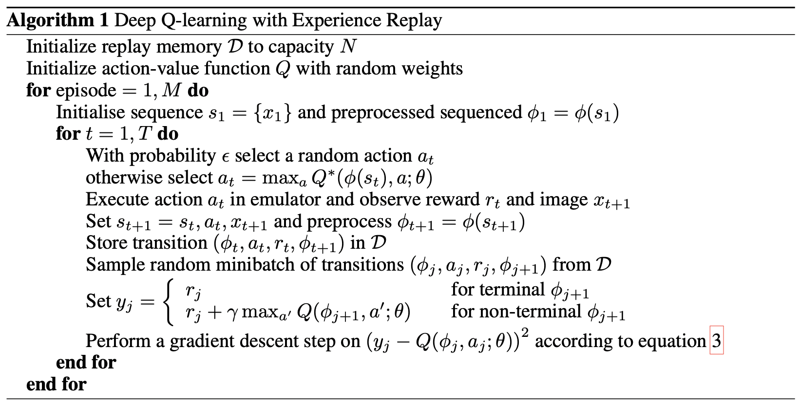
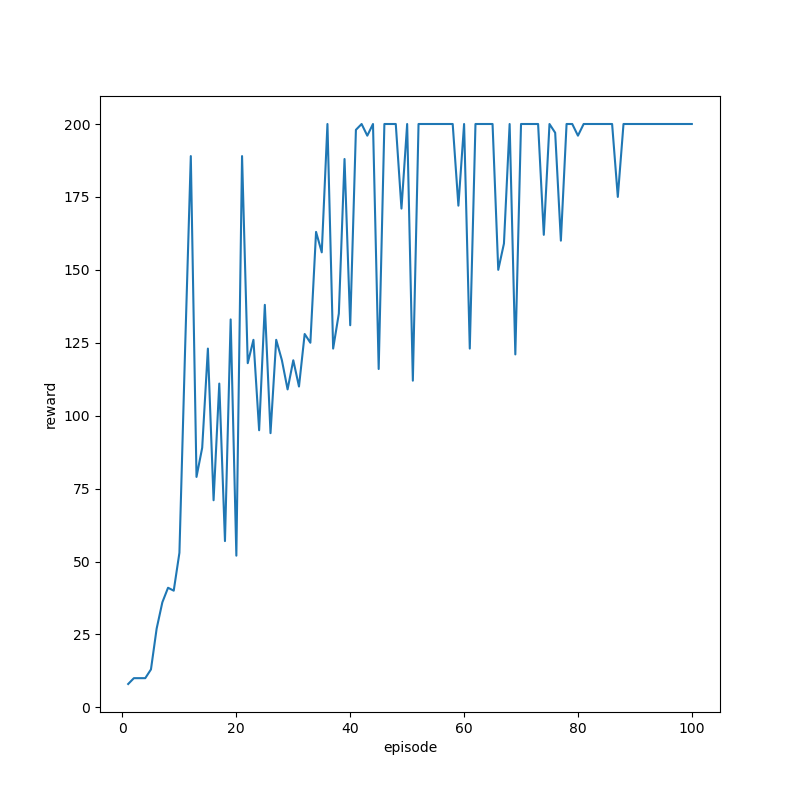

# dql

`dql.py` is an implementation of DeepMind's DQL algorithm given in this . 

Any game in OpenAI's gym environment can be trained using `dql.py`. Change the network architecture, the state pre-processing function, and hyperparameters in `net.py` and `train.py` for different environments (games), and run `train.py` to train the network. Reward graph gets saved in checkpoint.

Run `python play.py` to render the game. Make a checkpoint directory to store network state at each episode. In `play.py`, load the desired model in `torch.load`. Make sure to run `pip install requirements.txt` in your virtual environment (ideally conda) before playing around!

