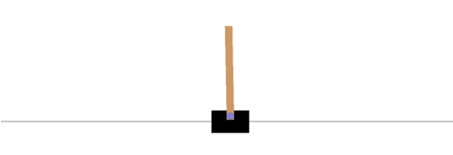

# dql

`dql.py` is an implementation of DeepMind's DQL algorithm given in this [paper](https://arxiv.org/abs/1312.5602). 

Any game in OpenAI's gym environment can be trained using `dql.py`. Change the network architecture, the state pre-processing function (change both of these in `net.py` for different environments), and hyperparameters in `net.py` and `train.py` (to load "Breakout-v0", change the `env` variable in `net.py` to `gym.make("Breakout-v0")`), and run `train.py` to train the network. Reward graph gets saved in checkpoint.

Run `play.py` to render the game. Make a checkpoint directory to store network state at each episode. In `play.py`, load the desired model in `torch.load` (or just use default). Make sure to run `pip install -r requirements.txt` in your virtual environment (conda) before playing around!

